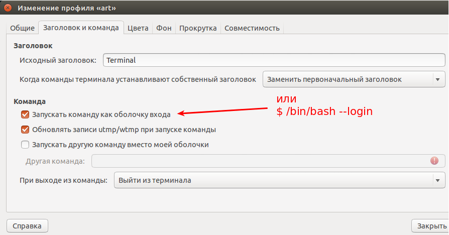

VIM
===

Files location:

```bash
~/.viminfo
~/.vimrc
/home/artem/.vim/
```

```bash
artem@AdminPC:~/.vim$ ls -a
.  ..  autoload  bundle  bundles.vim  .git  .gitignore  README.md  screenshots  vimrc_old
artem@AdminPC:~/.vim$ git remote -v
origingit://github.com/humiaozuzuzu/dot-vimrc.git (fetch)
origingit://github.com/humiaozuzu/dot-vimrc.githubit (push)
artem@AdminPC:~/.vim$ ls -a bundle
.                     nerdcommenter            vim-airline-themes    vim-monokai
..                    nerdtree                 vim-blackboard        vim-pathogen
ack.vim               PHP-Indenting-for-VIm    vim-coffee-script     vim-powerline
autoload              python-mode              vim-colors-solarized  vim-snipmate
base16-vim            rainbow_parentheses.vim  vim-distinguished     vim-snippets
ctrlp.vim             supertab                 vim-easymotion        vim-surround
delimitMate           syntastic                vim-fugitive          vim-togglemouse
emmet-vim             TabBar                   vim-go                vim-tomorrow-theme
fisa-vim-colorscheme  tabular                  vim-indent-guides     vim-trailing-whitespace
gundo.vim             tagbar                   vim-javascript        vim-vividchalk
html5.vim             tlib_vim                 vim-jinja             vundle
jquery.vim            vim-addon-mw-utils       vim-markdown          Vundle.vim
neocomplcache         vim-airline              vim-matchit
```


See also: `git://github.com/humiaozuzu/dot-vimrc.git`

## Screenshoots


## Terminal settings





Also see more screenshots (terminal_settings_4-7.png)
