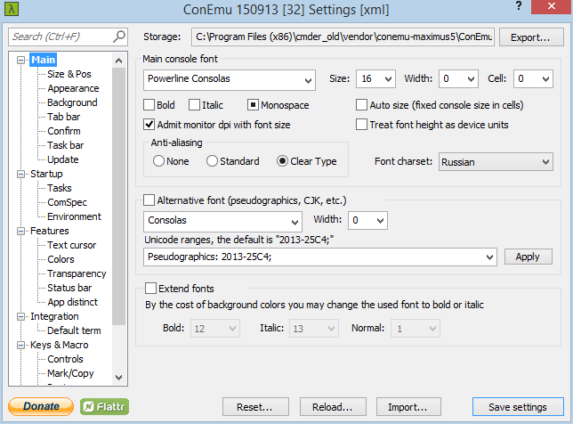
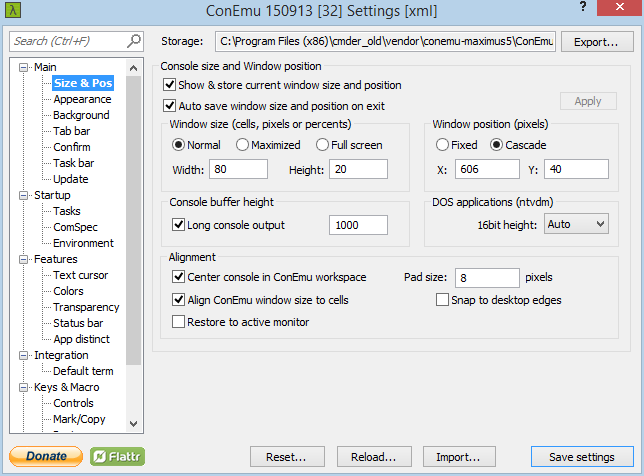
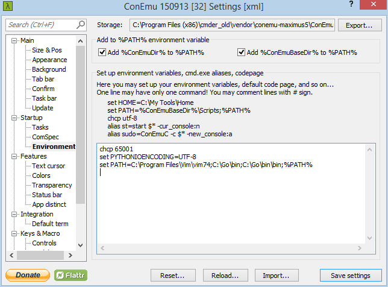

Cmder
=====

## Env

```
chcp 65001
set PYTHONIOENCODING=UTF-8
set PYTHONSTARTUP=%USERPROFILE%\.python-startup.py
set PATH=C:\Program Files\Vim\vim74;C:\Go\bin;C:\Go\bin\bin;%PATH%
set PATH=C:\rakudo\bin;C:\rakudo\share\perl6\site\bin;%PATH%
set PATH=%USERPROFILE%\rakudobrew\bin;%PATH%
```

## Settings screenshots






